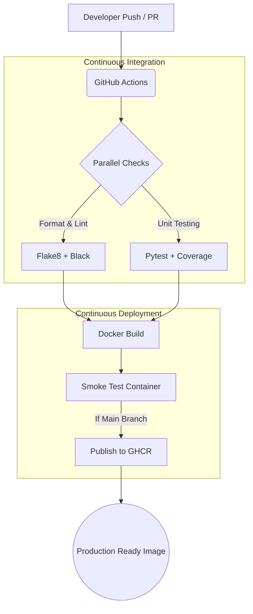

# Presentation Guide: DevOps Pipeline and UI

## Team Roles

**Person 1: CI/CD Pipeline Architect**
*   **Focus:** GitHub Actions, workflow orchestration, and pipeline efficiency.
*   **Responsibilities:** Designing the automated workflow triggered on push/PR, ensuring parallel job execution where possible, and configuring the final publish step to the GitHub Container Registry.

**Person 2: Build & Release Engineer**
*   **Focus:** Docker containerization, Makefiles, and environment consistency.
*   **Responsibilities:** Writing the multi-stage Dockerfile, ensuring non-root user execution, managing the `docker-compose.yml` for local testing, and standardizing build commands via `make`.

**Person 3: QA Automation Engineer**
*   **Focus:** Automated testing, code quality, and linting.
*   **Responsibilities:** Configuring `pytest` and `coverage`, integrating `flake8` and `black` into the pipeline, and ensuring code fails the build if it doesn't meet the 80% coverage threshold or styling guidelines.

## 1. Introduction to CI/CD
Continuous Integration and Continuous Deployment (CI/CD) is the backbone of modern software engineering. It bridges the gap between development and operations by automating the building, testing, and deployment of applications. 

For our **Chart Validation System**, CI/CD ensures that every piece of code we write is automatically tested for correctness, formatted consistently, and packaged into a deployable container. This means we can ship updates faster, with higher confidence, and without manual intervention. Our pipeline transforms code from a simple commit into a production-ready, highly available Docker image.

## 2. Tools Used & Their Roles
*   **GitHub Actions:** The core orchestration engine. It watches our repository for pushes or pull requests and automatically triggers the pipeline jobs.
*   **Docker:** The containerization platform. It packages our FastAPI application and its dependencies into a single, portable image, ensuring it runs exactly the same way in production as it does on our local machines.
*   **GitHub Container Registry (GHCR):** Our artifact repository. Once the Docker image is built and verified, it is published here, ready to be pulled by any production environment.
*   **Pytest & Coverage:** Our automated testing framework. It runs our 36+ test cases and strictly enforces an 80% minimum code coverage, failing the pipeline if quality drops.
*   **Flake8 & Black:** Our code quality and formatting tools. They automatically format the code and check for syntax or style errors, ensuring the entire codebase reads as if a single developer wrote it.
*   **Make:** Our local automation tool. It wraps complex commands into simple targets (like `make build` or `make test`), standardizing operations for both developers and the CI/CD pipeline.

## 3. CI/CD Architecture Diagram



## 4. Installation Steps Summary

To get the application running, we've standardized the process into a few simple steps:

1.  **Clone the Repository:** 
    ```bash
    git clone <repository-url>
    cd chart-validation-system
    ```
2.  **Environment Setup:** 
    *   Create a virtual environment: `python -m venv venv` and activate it.
    *   Copy the environment template: `cp .env.example .env` and generate secure keys.
    *   Install dependencies: `pip install -r requirements.txt`.
3.  **Local Execution (Development):** 
    *   Run `make dev` to start the server with hot-reload enabled.
4.  **Docker Execution (Production-Ready):** 
    *   Simply run `make compose-up` to build the multi-stage image and start the application along with its health checks.

## 5. Pipeline Implementation Flow

Our pipeline is triggered automatically on any push or pull request to the `main` branch. It executes in a strictly controlled sequence:

1.  **Trigger & Checkout:** The pipeline detects a commit and checks out the source code.
2.  **Code Quality Check (Linting):** The `flake8` and `black` tools inspect the code. If the formatting is off or there are syntax errors, the pipeline halts immediately, preventing messy code from advancing.
3.  **Automated Testing:** `pytest` executes our comprehensive test suite (handling API routes, validation logic, and database operations). It also checks code coverage. If coverage falls below 80%, the build fails.
4.  **Container Build:** A multi-stage Docker image is built. We ensure the image is lightweight and runs as a non-root user for stability.
5.  **Smoke Testing:** The newly built container is spun up temporarily. We hit its health check endpoints to guarantee the application actually starts and responds correctly inside the container.
6.  **Publish (Main Branch Only):** If all previous steps pass, and the trigger was a merge to the `main` branch, the final Docker image is pushed to the GitHub Container Registry, ready for deployment.
