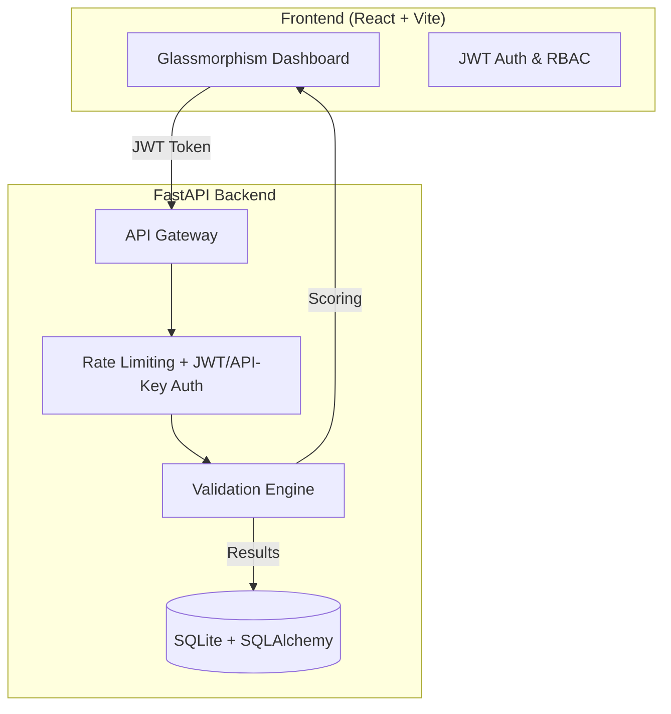

<div align="center">

# 📊 Chart Validation & Objective Compliance System

### *Does your chart actually say what you think it says?*

[](https://python.org)
[](https://fastapi.tiangolo.com)
[](https://react.dev)
[](https://github.com/PyCQA/bandit)
[](LICENSE)

**An enterprise-ready DevSecOps system that validates charts against their stated objectives — detecting misleading visuals using NLP and statistical analysis before they reach your audience.**

[📖 API Docs](http://localhost:8000/docs) · [🖥️ Dashboard](http://localhost:5174) · [📊 Metrics](http://localhost:8000/metrics)

</div>

---

## 🌟 The Problem This Solves

Tools like Tableau and Power BI are great at *generating* charts, but they don't validate whether a chart is **truthful or appropriate for its intent**. This system fills that gap by catching:

- 📉 **Objective Mismatch**: Using a pie chart for a "trend" (should be a line chart).
* 🍕 **Overcrowding**: Pie charts with 10+ slices that are unreadable.
* ⚠️ **Deceptive Scales**: Y-axes that don't start at zero for bar charts, inflating differences.
* 🔢 **Data Corruption**: Non-numeric values or extreme outliers that distort the visual scale.
* 📭 **Vague Intent**: Charts without stated objectives or descriptive titles.

---

## 🏗️ Architecture Overview



---

## 🛠️ Features

| Category | Feature |
|----------|---------|
| 🧠 **Intelligence** | 4-dimension weighted scoring engine (Structure, Objective, Quality, Viz) |
| 🧠 **Intelligence** | 30+ NLP keyword mapping (`trend` → Line, `compare` → Bar, etc.) |
| 🧠 **Intelligence** | IQR-based outlier detection to flag suspicious data entries |
| 🔐 **Security** | **RBAC**: Separate experiences for `Administrator` and `Standard User` |
| 🔐 **Security** | **Hybrid Auth**: Supports both modern JWT Bearer and legacy X-API-Key |
| 🔐 **Security** | Input sanitization with Pydantic `max_length` and `max_items` |
| 🖥️ **UI/UX** | **React 19 Dashboard**: Real-time previews, Glassmorphism design, and Framer Motion |
| ⚡ **Performance** | Async SQLAlchemy 2.0 with `aiosqlite` and `slowapi` rate limiting |

---

## 📊 Scoring System

Every chart is evaluated across **4 weighted dimensions** to produce an aggregate score (0-100):

| Dimension | Weight | Key Checks |
|-----------|:------:|------------|
| **Objective Match** | **35%** | NLP alignment between `chart_type` and `objective` keywords. |
| **Structure** | **30%** | Technical integrity, label-to-data mapping, and required fields. |
| **Data Quality** | **20%** | Numeric validity, outlier detection, and axis range sanity. |
| **Viz Best Practices** | **15%** | Readability (slice counts), zero-baselines, and attribution. |

> **Score ≥ 70** → `VALID` &nbsp;&nbsp;|&nbsp;&nbsp; **Score < 70** → `INVALID`

---

## 🚀 Quick Start

### 1. Prerequisites
*   Python 3.11+
*   Node.js 18+

### 2. Backend Setup
```bash
# Install dependencies
pip install -r requirements.txt

# Configure environment
# Ensure .env has: JWT_SECRET_KEY, SECRET_KEY, API_KEY
python -c "import secrets; print(secrets.token_hex(32))"

# Start FastAPI
uvicorn app.main:app --reload --port 8000
```

### 3. Frontend Setup
```bash
cd frontend
npm install

# Start Vite Development Server
npm run dev -- --port 5174
```

### 4. Default Credentials
| Username | Password | Role |
|----------|----------|------|
| `admin` | `password123` | **Administrator** |
| `user` | `password123` | **Standard User** |

---

## 📂 Project Structure

*   `app/api/` - Routes and rate limiting.
*   `app/services/` - Core **Validation Engine** logic.
*   `app/core/` - Security, JWT, and Database configuration.
*   `frontend/src/` - React components, context, and styles.
*   `tests/` - 36+ unit and integration tests.

---

## 🛡️ DevSecOps Integration

The system includes a pre-configured **7-job GitHub Actions pipeline** that performs:
*   **SAST**: Bandit security scanning.
*   **Linting**: Flake8 and Black verification.
*   **DCA**: Dependency vulnerability checks (Safety).
*   **Testing**: Pytest with coverage enforcement (80%+).
*   **Docker**: Multi-stage, non-root builds on Alpine Linux with health checks.
*   **SBOM**: CycloneDX Software Bill of Materials generation.

---

<div align="center">
Built with FastAPI · React · SQLAlchemy · Framer Motion · Bandit · Safety
</div>
